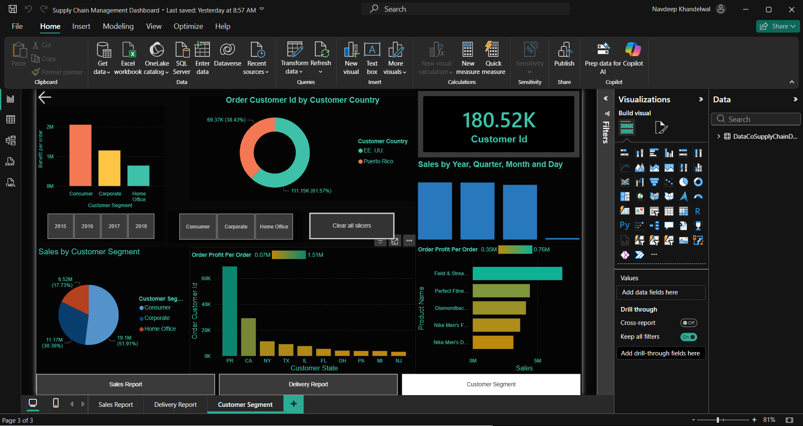

# supply-chain-analytics-dashboard-powerbi
Power BI dashboard analyzing inventory, supplier performance, and order fulfillment to generate supply chain insights.
Supply Chain Analytics Dashboard (Power BI)

Project Overview:-
This project analyzes supply chain operations using Power BI to monitor inventory levels, supplier performance, order fulfillment rate, and logistics efficiency.
The dashboard provides key operational KPIs to help businesses optimize stock management and improve supply chain performance.

Key Features:-
Inventory level tracking
Supplier performance analysis
Order fulfillment monitoring
Lead time analysis
Supply chain KPI metrics

Tools Used:-
Power BI
DAX
Excel
Data Modeling

Key Insights:-
Identified suppliers causing shipment delays
Highlighted inventory shortages across product categories
Monitored order fulfillment efficiency across regions

Dashboard Preview:-

Project Files
Power BI Dashboard (.pbix)

Dataset
Dashboard Screenshot

Author
Navdeep Khandelwal
Data Analyst | SQL | Excel | Power BI | Tableau
